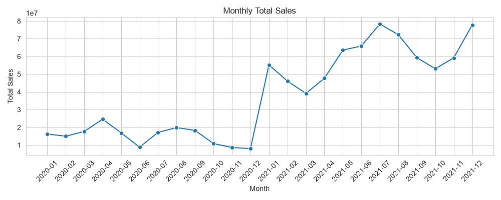
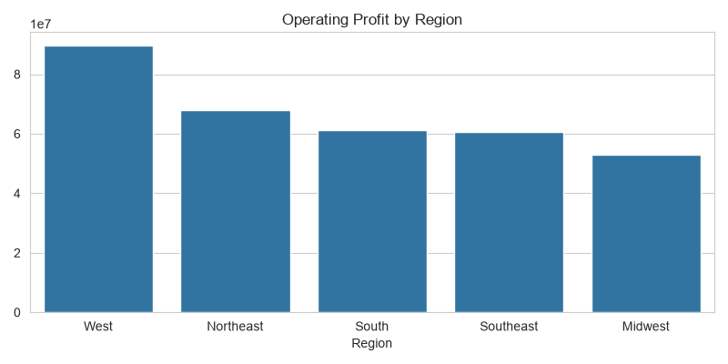
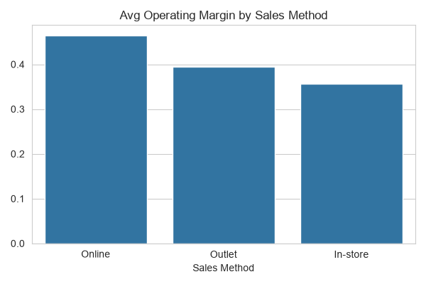
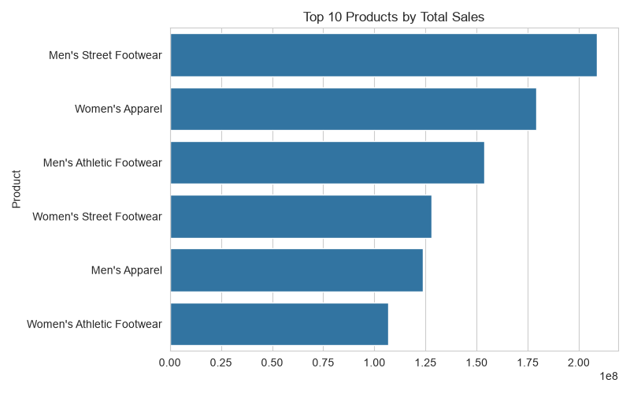
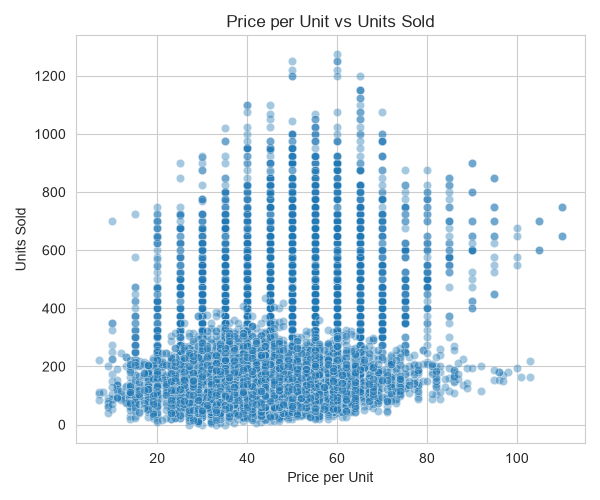
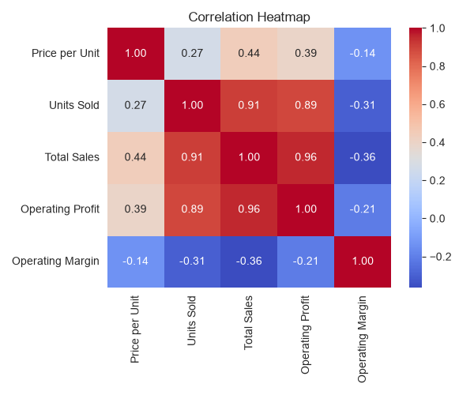

# Adidas Sales Project

This repository brings together a full data-science workflow for Adidas sales analysis, from raw CSVs to a small interactive dashboard. The project focuses on understanding sales performance, profit drivers, and margin behavior using a realistic retail dataset.

## Problem statement

The goal is to answer a few practical business questions:

- Which regions and sales methods are most profitable?
- Which products drive the strongest sales volume?
- Can we predict a margin bucket from business context alone, rather than from obvious leakage features?
- How well does a lightweight forecasting baseline capture monthly sales trend?

## Data

The analysis uses the provided Adidas datasets in the data folder:

- adidas_sales.csv: raw sales transactions
- adidas_cleaned.csv: cleaned and standardized sales data
- adidas_features.csv: engineered features used for modeling and API consumption

The project also includes exploratory charts in data/charts to support the analysis narrative.

## Project phases

1. Data cleaning
   - Standardized column names and data types
   - Removed inconsistencies and handled missing values

2. Feature engineering
   - Built supporting features for analysis and downstream modeling
   - Prepared a modeling-friendly dataset

3. Exploratory data analysis
   - Investigated sales trends, regional profitability, product contribution, and margin behavior
   - Produced visual summaries used in the dashboard and README

4. Modeling
   - Trained a classification model to predict margin buckets (Low/Medium/High)
   - Tested a simple monthly-sales forecasting baseline

5. Backend API
   - Built a FastAPI service to expose summary statistics and predictions

6. Frontend dashboard
   - Built a React + Recharts dashboard with cross-filtering between charts

## Results

The project demonstrates a complete end-to-end workflow:

- A polished dashboard that summarizes sales performance and profit patterns
- A FastAPI backend that serves analytics and model predictions
- A simple machine-learning pipeline that uses only business context features

Representative outputs from the analysis:













## Honest findings

This project includes a few findings that matter more than polished metrics alone:

- Class imbalance mattered. The target margin buckets were not evenly distributed, so a model that overfit to the majority class could look reasonable on raw accuracy while missing minority cases. Balancing strategies were tested, but they improved minority recall at the cost of overall stability, so the final modeling approach stayed focused on a more realistic tradeoff.
- Leakage was a real concern. Features such as price per unit, units sold, total sales, and operating profit are directly tied to margin, so including them would make the task trivial and inflate performance. The model was therefore restricted to business-context features like Region, Product, and Sales Method to avoid a misleading result.
- A single train/test split can be misleading. A single split can overstate or understate performance depending on how the data happens to divide. Cross-validation was therefore used to get a more reliable view of model behavior.

These are the kinds of details that separate a real project from a tutorial-style demo.

## Tech stack

- Python
- pandas
- scikit-learn
- FastAPI
- React
- Vite
- Recharts
- Matplotlib / Seaborn

## Repository structure

- notebooks/: data cleaning, feature engineering, EDA, and modeling notebooks
- backend/: FastAPI API and prediction service
- frontend/: Vite + React dashboard
- data/: datasets, model artifacts, and chart exports

## Running locally

### 1. Prepare the Python environment

```bash
cd backend
pip install -r requirements.txt
```

### 2. Run the API

```bash
cd backend
uvicorn main:app --reload
```

### 3. Run the dashboard

```bash
cd frontend
npm install
npm run dev
```

Then open the local Vite URL and the dashboard will call the backend at localhost:8000.

## Notes

The project is intentionally structured as a full-stack demonstration: the notebooks show the analysis process, the backend exposes the outputs, and the frontend makes the results interactive.
